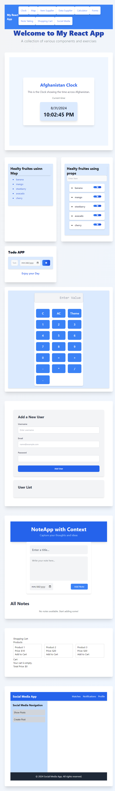

# React-Playground

Welcome to **React-Playground**! This repository is a collection of various React projects and components, designed to showcase different features and techniques in React development. Whether you're learning React or looking for inspiration, this playground offers a variety of small applications and exercises to explore.

Screenshots

To provide a visual overview of the project, you can add screenshots to the `src/assets/screenshots/` directory. Reference the images in the `README.md` as follows:

## Screenshots




## Projects Included

Here are the projects and components included in this playground:

- **ClockApp**: A clock application showcasing time display functionalities.
- **MapPractice**: A project focusing on integrating and practicing with maps.
- **LearningProps**: An item supplier component for managing and displaying items.
- **TodoApp**: A data supplier component used in a to-do list application.
- **Calculator**: A calculator application demonstrating fundamental arithmetic operations.
- **FormHandling**: A form component for practicing form handling and validation.
- **NoteApp**: A note-taking application utilizing context for state management.
- **CartApp**: A shopping cart component for managing and displaying cart items.
- **SocialMediaApp**: A social media application with various interactive features.

## Getting Started

To get started with **React-Playground**, follow the instructions below.

### Prerequisites

Make sure you have [Node.js](https://nodejs.org/) installed on your system. You can check your Node.js version by running:

```bash
node -v
```

### Installation

1. Clone the repository to your local machine:

   ```bash
   git clone https://github.com/your-username/react-playground.git
   ```

2. Navigate to the project directory:

   ```bash
   cd react-playground
   ```

3. Install the necessary dependencies:

   ```bash
   npm install
   ```

### Running the Application

To start the development server and view the project in your browser:

```bash
npm run dev
```

This will start a local development server and open your default browser to `http://localhost:####`, where you can explore the **React-Playground**.

### Folder Structure

Here's a brief overview of the folder structure:

```
react-playground/
├── src/
│   ├── AfghanistanClock/
│   │   └── ClockApp.js
│   ├── LeraningMap/
│   │   └── MapPractice.js
│   ├── LearningPros/
│   │   └── ItemSupplier.js
│   ├── TodoListProps/
│   │   └── DataSupplier.js
│   ├── Calculator/
│   │   └── MainContainer.js
│   ├── Forms/
│   │   └── MainForm.js
│   ├── NoteTakingContext/
│   │   └── NoteApp.js
│   ├── ShoppingCart/
│   │   └── CartApp.js
│   └── SocialMediaApp/
│       └── SocialMediaApp.js
├── public/
├── package.json
└── README.md
```

### Contact

For any questions or suggestions, please reach out to [inaveed.contact@gmail.com](mailto:your-email@example.com).

# React-Playground

Welcome to **React-Playground**! This repository is a collection of various React projects and components, designed to showcase different features and techniques in React development. Whether you're learning React or looking for inspiration, this playground offers a variety of small applications and exercises to explore.

## Projects Included

Here are the projects and components included in this playground:

- **ClockApp**: A clock application showcasing time display functionalities.
- **MapPractice**: A project focusing on integrating and practicing with maps.
- **LearningProps**: An item supplier component for managing and displaying items.
- **TodoApp**: A data supplier component used in a to-do list application.
- **Calculator**: A calculator application demonstrating fundamental arithmetic operations.
- **FormHandling**: A form component for practicing form handling and validation.
- **NoteApp**: A note-taking application utilizing context for state management.
- **CartApp**: A shopping cart component for managing and displaying cart items.
- **SocialMediaApp**: A social media application with various interactive features.

## Getting Started

To get started with **React-Playground**, follow the instructions below.

### Prerequisites

Make sure you have [Node.js](https://nodejs.org/) installed on your system. You can check your Node.js version by running:

```bash
node -v
```

### Installation

1. Clone the repository to your local machine:

   ```bash
   git clone https://github.com/your-username/react-playground.git
   ```

2. Navigate to the project directory:

   ```bash
   cd react-playground
   ```

3. Install the necessary dependencies:

   ```bash
   npm install
   ```

### Running the Application

To start the development server and view the project in your browser:

```bash
npm run dev
```

This will start a local development server and open your default browser to `http://localhost:####`, where you can explore the **React-Playground**.

### Folder Structure

Here's a brief overview of the folder structure:

```
react-playground/
├── src/
│   ├── AfghanistanClock/
│   │   └── ClockApp.js
│   ├── LeraningMap/
│   │   └── MapPractice.js
│   ├── LearningPros/
│   │   └── ItemSupplier.js
│   ├── TodoListProps/
│   │   └── DataSupplier.js
│   ├── Calculator/
│   │   └── MainContainer.js
│   ├── Forms/
│   │   └── MainForm.js
│   ├── NoteTakingContext/
│   │   └── NoteApp.js
│   ├── ShoppingCart/
│   │   └── CartApp.js
│   └── SocialMediaApp/
│       └── SocialMediaApp.js
├── public/
├── package.json
└── README.md
```

### Contact

For any questions or suggestions, please reach out to [inaveed.contact@gmail.com](mailto:your-email@example.com).
